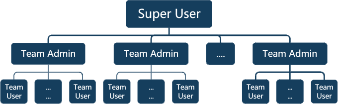
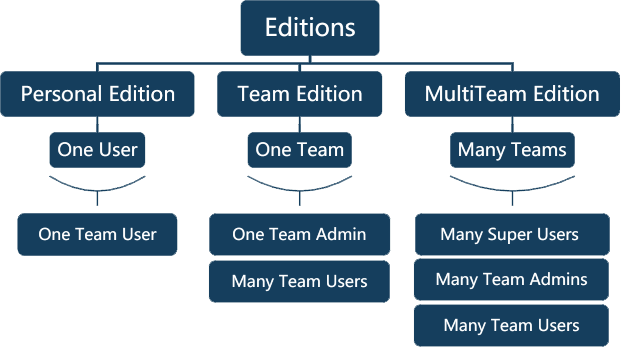

.. _intro:

.. rst-class:: title-center
   
##################################################################################################
介绍
##################################################################################################
   

.. admonition:: 在线演示
    
    请访问以下页面以探索并测试 SimpleELN 的功能:
        
        :octicon:`dot;1em;sd-text-primary` http://www.simpleeln.com
    

SimpleELN 是一款基于关系数据库管理系统（如 MySQL）来永久存储数据的在线电子实验室笔记本应用程序。其主要目的是提供一个简单高效的电子实验记录系统，模拟电子白板，允许用户根据需求和审美记录实验数据，包括文本、图片、图表和文件。

除了能够单独记录实验数据外，SimpleELN 还具有数据共享功能。用户可以相互共享数据，每个实验记录的所有者（创建者）可以根据需要与其他用户共享记录，并设置只读或读写权限。这一共享功能使得团队成员能够轻松协作与沟通，提升了实验工作的效率和便利性。

当实验记录被共享时，其他用户将获得相应的权限，访问和操作共享的实验记录。如果记录设置为只读，其他用户只能查看并评论记录，但不能进行编辑或其他操作；如果记录设置为读写，其他用户则可以查看、评论、编辑以及进行其他操作。通过共享和协作功能，SimpleELN 帮助团队成员更好地管理和协作实验数据，从而提高工作效率和数据安全性。

====================================================================================================================
用户角色
====================================================================================================================

在系统中，任何注册用户有三种不同的角色：超级用户、团队管理员和团队用户。每个超级用户可以管理多个团队，而每个团队会指定一个团队管理员，团队管理员负责管理多个团队用户。

:团队用户: 团队用户可以执行基本的电子笔记本操作，例如创建和编辑实验记录、查看和搜索实验数据、以及与其他用户协作。由于所有团队用户都由同一团队管理员管理，团队用户也称为组用户。

:团队管理员: 团队管理员不仅可以执行基本的电子笔记本操作，还可以管理团队用户账户，包括添加或锁定用户账户，并查看团队用户的实验记录。由于一个团队管理员管理多个团队用户账户，因此也被称为组管理员。

:超级用户: 超级用户拥有执行所有管理任务的权限，包括添加或锁定团队管理员和团队用户账户。

====================================================================================================================
版本
====================================================================================================================

SimpleELN 应用程序包括单用户版（个人版）和服务器版，服务器版进一步分为单团队版（团队版）和多团队版（多团队版）。所有版本共享相同的实验笔记本管理功能，但版本之间的主要区别在于是否支持在同一团队内或不同团队之间共享实验记录。对于个人用户，推荐使用单用户版，因为所有数据都存储在用户的个人计算机上，提供更高的数据安全性，减少了意外泄露的风险。而团队版则需要安装在服务器上，团队成员通过网络连接访问和管理 SimpleELN 应用程序。单团队版允许团队成员之间轻松共享数据，而多团队版则允许不同团队之间共享数据。

:个人版: 个人版专为个人用户量身定制，使其能够创建和管理自己的实验记录。它提供了电子笔记本的所有功能，但不包括与他人共享的能力。安装在个人计算机上时，个人版会自动管理底层数据库和 Web 服务器。该版本非常适合个人使用，能够确保数据安全性，并提供用户友好的安装和日常使用体验。这是唯一在个人计算机上安装的版本，而不是服务器上。

:团队版: 团队版适用于团队型组织，可以创建一个团队账户，并指定团队管理员角色，同时可以创建多个团队用户账户。团队管理员和团队用户都可以访问电子笔记本操作的所有功能。此外，所有实验记录可以与团队成员共享，权限范围从查看/评论到读写/评论不等。团队管理员可以查看所有团队用户的实验记录并进行评论。该版本特别适合需要团队成员协作的单一实验室或组织。此版本专为安装在服务器上设计，仅提供命令行安装说明。

:多团队版: 多团队版专为拥有多个独立团队的部门、中心、公司、组织等实体量身定制。在此版本中，可以创建一个超级用户账户，超级用户可以创建多个团队账户，每个团队账户都由指定的团队管理员管理，并包含多个团队用户。团队管理员和团队用户都可以访问电子笔记本操作的所有功能，实验记录可以在不同团队或同一团队内轻松共享，权限范围从查看/评论到读写/评论不等。此版本特别适用于需要跨团队协作的多团队实验室或组织，团队用户可以在共享的实验室笔记本上进行合作。此版本专为安装在服务器上设计，仅提供命令行安装说明。

总结而言，SimpleELN 的三个版本旨在满足不同用户的需求和权限，提供灵活的选择，帮助用户根据自己的角色和职责选择最适合的版本。这使得实验数据管理和用户间的协作更加高效、安全和灵活。

.. warning:: 
    
    请注意，具体功能可能会因 SimpleELN 的版本、配置设置和权限分配的不同而有所不同。如有更具体的问题或需求，建议查阅软件的用户手册或联系软件供应商获取详细信息。这将帮助您了解 SimpleELN 在不同场景中的具体功能和应用，帮助您做出更明智的选择。此外，在使用管理员模式时，请谨慎操作，确保理解所执行操作的影响和潜在风险，避免不必要的错误或损失。
    