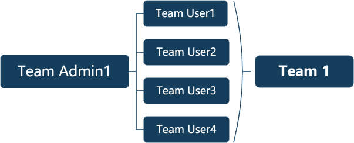
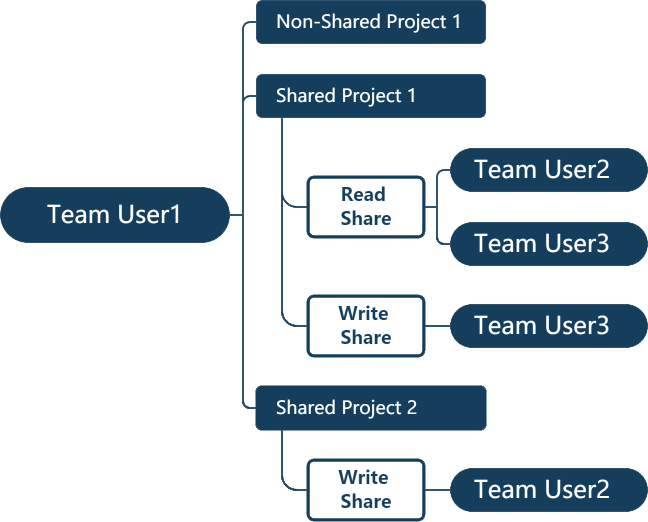
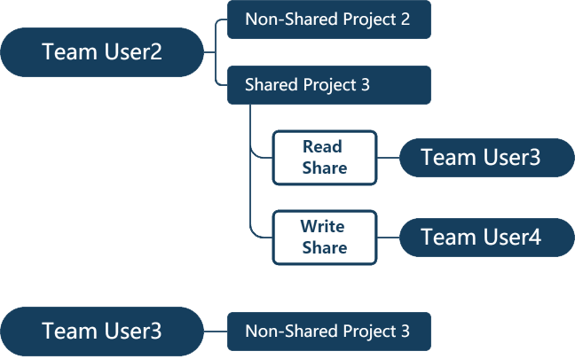

.. _project-management-project-share-team-edition:

.. role:: custom-color-primary
   :class: sd-text-primary

.. role:: custom-color-dark
   :class: sd-text-dark

.. rst-class:: title-center h1
    
团队成员之间的笔记本共享

##################################################################################################
概述
##################################################################################################

如果项目尚未创建，任何已注册的用户，无论是团队管理员（Team Admin）还是普通团队用户（Team User），都可以作为项目的创建者创建新项目（超级用户除外）。

**注意：** 只有项目的创建者才有权限设置项目的共享权限，权限可以选择为只读/评论（read-only/comment）或读写/评论（read-write/comment）。

不同用户的共享权限如下所示：

- 创建者 **(Creator)**
    - 完全权限：
        
        - 读写/评论访问权限
        - 修改自己的注释数据权限
        - 无法修改其他用户的注释数据
        
- 团队用户 **(Team User)**
    - **没有共享权限：** 如果项目创建者未共享该项目，团队用户将无法访问该项目
    - **只读/评论共享权限：** 如果项目创建者将项目设置为只读/评论权限，团队用户可以查看和评论该项目，但无法进行编辑
    - **读写/评论共享权限：** 如果项目创建者将项目设置为读写/评论权限，团队用户可以查看、评论并编辑该项目
        
        - 只能修改自己创建的注释数据
        - 无法修改其他用户的注释和实验数据
        - 在共享项目拥有自己创建实验数据的权限
    
- 团队管理员 **(Team Admin)** 
    - **只读/评论共享权限：** 如果项目创建者未共享该项目或设置为只读/评论权限，团队管理员可以查看和评论该项目。
    - **读写/评论共享权限：** 如果项目创建者将项目设置为读写/评论权限，团队管理员可以查看、评论并编辑该项目
        
        - 只能修改自己创建的注释数据
        - 无法修改其他用户的注释数据
        - 对其管理的成员用户所有笔记本均拥有只读/评论共享权限
    

要设置项目共享权限，项目的创建者可以选择以下选项：
    
    - 首先创建一个非共享项目，然后与同一团队的成员共享。请参考 :ref:`创建和分享非共享项目 <project-management-project-share-team-share-non-shared-project>`.
        
        - :ref:`创建非共享项目 <project-management-project-share-team-share-non-shared-project-create>`
        - :ref:`分享非共享项目 <project-management-project-share-team-share-non-shared-project-share>`
        
    - 创建一个共享项目，并在项目创建时选择共享的用户。请参考 :ref:`创建和分享共享项目 <project-management-project-share-team-share-shared-project>`.
        
        - :ref:`创建共享项目 <project-management-project-share-team-share-shared-project-create>`
        - :ref:`分享共享项目 <project-management-project-share-team-share-shared-project-share>`
        
    - 编辑现有项目的共享用户信息。请参考 :ref:`编辑现有项目的共享权限 <project-management-project-share-team-edit-shared-project>`.
        
        - :ref:`添加共享权限 <project-management-project-share-team-edit-shared-project-add>`
        - :ref:`移除共享权限 <project-management-project-share-team-edit-shared-project-remove>`
        

.. _project-management-project-share-team-share-non-shared-project:

##################################################################################################
创建和分享非共享项目
##################################################################################################

.. _project-management-project-share-team-share-non-shared-project-create:

====================================================================================================================
创建非共享项目
====================================================================================================================

项目创建者创建一个新的非共享项目。尽管该项目未与其他团队成员共享，但项目创建者所在团队的团队管理员对该非共享项目拥有只读/评论权限。

    - 从左侧导航面板，点击 |bi-book| **New Project** ，跳转到创建新项目页面
    
        - 选项 1：从左侧导航面板，依次选择 |metro-ui-css-mif-books| **My Projects** :octicon:`chevron-right` |bi-book| **New Project**
        - 选项 2：从左侧导航面板，依次选择 |bi-folder-symlink-fill-black| **Collaborations** :octicon:`chevron-right` :octicon:`person-fill` **用户名** :octicon:`star-fill;1em;sd-text-danger` :octicon:`chevron-right` |bi-book| **New Project**
        
    - 输入一个有意义的句子作为项目标题 **(Project Title)**
    - 输入有意义的关键词作为项目标签 **(Project Tags)**.
    - 完成并提交表单
    - 有关如何创建新非共享项目的详细步骤说明，请参阅资料 :ref:`创建非共享项目 <project-management-project-share-team-share-non-shared-project-create-screenshots>`
    - **注意：** 共享访问权限在项目级别上进行设置。有关如何为新项目输入其他数据的详细信息，请参阅资料: :ref:`笔记本创建 <project-management-project-creation>`

.. _project-management-project-share-team-share-non-shared-project-share:

====================================================================================================================
分享非共享项目
====================================================================================================================

对于已存在的非共享项目，如果项目的创建者希望将该项目与特定团队成员共享，那么可以为这些成员设置只读/评论或读写/评论权限。即使该项目未与创建者所在团队的团队管理员共享，项目创建者所在团队的团队管理员仍然拥有该项目的只读/评论权限。请按照以下说明配置项目的共享访问权限：

- 选项 1：通过 |metro-ui-css-mif-books| **My Projects** 入口分享非共享项目
    
    - 从左侧导航面板，依次选择 |metro-ui-css-mif-books| **My Projects** :octicon:`chevron-right` |bi-book-half| **项目标题** ，进入项目详情页面
    - 在 **Project** 标签下，点击 |bi-book-half| **项目标题** ，查看项目注释
    - 点击 **Edit Share** |fa-share-from-square| 图标，进入共享配置页面
    - 在 **Project** 标签下，依次点击 |metro-ui-css-mif-users| :custom-color-primary:`Shared Users` 和 |metro-ui-css-mif-user-plus| **New Share** 图标，进入共享用户设置页面
    - 点击 **Select** 按钮，选择并配置用户，设置其为 **只读/评论** 或 **读写/评论** 权限
    - 在弹出的界面，输入用户名或从下拉列表中选择用户，然后点击 **Add** 按钮
    - 提交表单
    - 请参考文档 :ref:`分享非共享项目 <project-management-project-share-team-share-non-shared-project-share-screenshots-1>` ，以获取详细的步骤说明

- 选项 2：通过 |bi-house-gear-fill| **Share Admin** 入口分享非共享项目
    
    - 从左侧导航面板，依次选择 |bi-house-gear-fill| **Share Admin** :octicon:`chevron-right` **New Share** ，进入新项目共享页面
    - 从相应的下拉列表中，依次选择 **项目 (Project)** 和 **用户 (User)**
    - 勾选 **Sharing Permission** 复选框
    - 点击 **Share the project** 按钮，添加共享权限
    - 请参考文档 :ref:`分享非共享项目 <project-management-project-share-team-share-non-shared-project-share-screenshots-2>` ，获取详细的步骤说明

.. _project-management-project-share-team-share-shared-project:

##################################################################################################
创建并分享共享项目
##################################################################################################

.. _project-management-project-share-team-share-shared-project-create:

====================================================================================================================
创建共享项目
====================================================================================================================

项目创建者可以创建一个新的共享项目，该项目默认对未被授予共享访问权限的其他团队成员不可见。然而，即使该项目没有显式地与创建者所在团队的团队管理员共享，团队管理员仍然拥有该项目的只读/评论权限。

- 在左侧导航面板中，点击 |bi-book| **New Project** ，进入 **创建新项目** 页面
    
    - 选项 1：从左侧导航面板，依次选择 |metro-ui-css-mif-books| **My Projects** :octicon:`chevron-right` |bi-book| **New Project**
    - 选项 2：从左侧导航面板，依次选择 |bi-folder-symlink-fill-black| **Collaborations** :octicon:`chevron-right` :octicon:`person-fill` **用户名** :octicon:`star-fill;1em;sd-text-danger` :octicon:`chevron-right` |bi-book| **New Project**
    
- 在 **Project** 标签下，填写项目的 **标题(Title)** 和 **标签(Tags)** 表单字段
- 点击 |bi-folder-symlink-fill| **Share the project** 按钮，将项目与其他用户共享
- 点击 **Select** 按钮，选择并配置用户的共享权限，选择 **只读/评论** 或 **读写/评论**
- 输入用户名或从下拉列表中选择用户，然后点击 **Add** 按钮
- 提交表单
- 请参考文档 :ref:`创建共享项目 <project-management-project-share-team-share-shared-project-create-screenshots>` ，获取详细的创建共享项目的步骤说明。
- **注意：** 共享权限是在项目级别进行设置的，请参考文档 :ref:`笔记本创建 <project-management-project-creation>` ，了解如何为新项目添加额外数据。

.. _project-management-project-share-team-share-shared-project-share:

====================================================================================================================
分享共享项目
====================================================================================================================

如果已有共享项目，项目创建者可以为特定团队成员设置 **只读/评论** 或 **读写/评论** 权限。即使该项目没有与创建者所在团队的团队管理员共享，管理员仍然拥有该项目的 **只读/评论** 权限。请按照以下说明配置项目的共享访问权限：

- 选项 1：通过 |bi-folder-symlink-fill-black| **Collaborations** 入口分享共享项目
    
    - 从左侧导航面板，依次选择 |bi-folder-symlink-fill-black| **Collaborations** :octicon:`chevron-right` :octicon:`person-fill` **用户名** :octicon:`star-fill;1em;sd-text-danger` :octicon:`chevron-right` |bi-book-half| **项目标题** ，进入项目详情页面
    - 在 **Project** 标签下，点击 |bi-book-half| **项目标题** ，查看项目注释
    - 点击 **Edit Share** |fa-share-from-square| 图标，进入共享配置页面
    - 在 **Project** 标签下，依次点击 |metro-ui-css-mif-users| :custom-color-primary:`Shared Users` 和 |metro-ui-css-mif-user-plus| **New Share** 图标，进入共享用户设置页面
    - 点击 **Select** 按钮，选择并配置用户，设置其为 **只读/评论** 或 **读写/评论** 权限
    - 在弹出的界面，输入用户名或从下拉列表中选择用户，然后点击 **Add** 按钮
    - 提交表单
    - 请参考文档 :ref:`分享共享项目 <project-management-project-share-team-share-shared-project-share-screenshots-1>` ，获取详细的步骤说明。
    

- 选项 2：通过 |bi-house-gear-fill| **Share Admin** 入口分享共享项目
    
    - 从左侧导航面板，依次选择 |bi-house-gear-fill| **Share Admin** :octicon:`chevron-right` **New Share** ，进入新项目共享页面
    - 从相应的下拉列表中，依次选择 **项目 (Project)** 和 **用户 (User)**
    - 勾选 **Sharing Permission** 复选框
    - 点击 **Share the project** 按钮，添加共享权限
    - 请参考文档 :ref:`分享共享项目 <project-management-project-share-team-share-shared-project-share-screenshots-2>` ，获取详细的步骤说明

.. _project-management-project-share-team-edit-shared-project:

##################################################################################################
编辑现有项目的共享权限
##################################################################################################

对于现有项目，只有项目创建者可以根据需要修改指定团队成员的共享权限。项目对没有获得共享访问权限的其他团队成员不可见。即使该项目没有与创建者所在团队的团队管理员共享，管理员仍然拥有该项目的 只读/评论 权限。

.. _project-management-project-share-team-edit-shared-project-add:

====================================================================================================================
添加现有项目的共享权限
====================================================================================================================

- 选项 1：通过 **Edit Share** |fa-share-from-square| 入口添加共享权限
    
    - 在左侧导航面板中，点击 |bi-book-half| **项目标题** ，进入项目详情页面
        
        - 选项 1：从左侧导航面板，依次选择 |metro-ui-css-mif-books| **My Projects** :octicon:`chevron-right` |bi-book-half| **项目标题**
        - 选项 2：从左侧导航面板，依次选择 |bi-folder-symlink-fill-black| **Collaborations** :octicon:`chevron-right` :octicon:`person-fill` **用户名** :octicon:`star-fill;1em;sd-text-danger` :octicon:`chevron-right` |bi-book-half| **项目标题**
        
    - 在 **Project** 标签下，点击 |bi-book-half| **项目标题** ，查看项目注释
    - 点击 **Edit Share** |fa-share-from-square| 图标，进入共享配置页面
    - 在 **Project** 标签下，依次点击 |metro-ui-css-mif-users| :custom-color-primary:`Shared Users` 和 |metro-ui-css-mif-user-plus| **New Share** 图标，进入共享用户设置页面
    - 点击 **Select** 按钮，选择并配置用户，设置其为 **只读/评论** 或 **读写/评论** 权限
    - 在弹出的界面，输入用户名或从下拉列表中选择用户，然后点击 **Add** 按钮
    - 提交表单
    - 请参考文档 :ref:`为现有非共享项目添加共享权限 <project-management-project-share-team-edit-shared-project-add-screenshots-1-1>` ，获取详细的步骤说明
    - 请参考文档 :ref:`为现有共享项目添加共享权限 <project-management-project-share-team-edit-shared-project-add-screenshots-1-2>` ，获取详细的步骤说明

- 选项 2：通过 |bi-house-gear-fill| **Share Admin** 入口添加共享权限
    
    - 在左侧导航面板中，依次选择 |bi-house-gear-fill| **Share Admin** :octicon:`chevron-right` **New Share** ，进入新项目共享页面
    - 从相应的下拉列表中，依次选择 **项目 (Project)** 和 **用户 (User)**
    - 勾选 **Sharing Permission** 复选框
    - 点击 **Share the project** 按钮，添加共享权限
    - 请参考文档 :ref:`为现有项目添加共享权限 <project-management-project-share-team-edit-shared-project-add-screenshots-2>` ，获取详细的步骤说明

.. _project-management-project-share-team-edit-shared-project-remove:

====================================================================================================================
移除现有项目的共享权限
====================================================================================================================

- 选项 1：通过 **Edit Share** |fa-share-from-square| 入口移除共享权限
    
    - 从左侧导航面板，依次选择 |bi-folder-symlink-fill-black| **Collaborations** :octicon:`chevron-right` :octicon:`person-fill` **用户名** :octicon:`star-fill;1em;sd-text-danger` :octicon:`chevron-right` |bi-book-half| **项目标题** ，进入项目详情页面
    - 在 **Project** 标签下，点击 |bi-book-half| **项目标题** ，查看项目注释
    - 点击 **Edit Share** |fa-share-from-square| 图标，进入共享配置页面
    - 在 **Project** 标签下，点击 |metro-ui-css-mif-users| :custom-color-primary:`Shared Users` ，查看现有的共享权限
    - 勾选 **Lock** 复选框，禁用该用户的共享访问权限
    - 点击 **Lock Users** 按钮，确认共享权限的更改
    - 请参考文档 :ref:`移除现有项目的共享权限 <project-management-project-share-team-edit-shared-project-remove-screenshots-1>` ，获取详细的步骤说明

- 选项 2：通过 |bi-house-gear-fill| **Share Admin** 入口移除共享权限
    
    - 在左侧导航面板中，依次选择 |bi-house-gear-fill| **Share Admin** :octicon:`chevron-right` **View Shares** ，进入共享项目页面
    - 在 **Group By Project** 标签下，勾选 **Lock** 复选框，禁用该用户的共享访问权限
    - 点击 **Apply** 按钮，确认共享权限的更改
    - 请参考文档 :ref:`移除现有项目的共享权限 <project-management-project-share-team-edit-shared-project-remove-screenshots-2>` ，获取详细的步骤说明

.. rst-class:: title-center h1
    
屏幕截图

##################################################################################################
演示分享笔记本的屏幕截图
##################################################################################################

.. _project-management-project-share-team-share-non-shared-project-create-screenshots:

============================================================================================================
创建非共享项目
============================================================================================================

    .. admonition:: 创建非共享项目
        
        - 从左侧导航面板，依次选择 |metro-ui-css-mif-books| **My Projects** :octicon:`chevron-right` |bi-book| **New Project** ，跳转到创建新项目页面 |circle-1-filled|
        - 输入一个有意义的句子作为项目标题 **(Project Title)** |circle-2-filled|
        - 输入有意义的关键词作为项目标签 **(Project Tags)** |circle-3-filled|
        - 完成并提交表单
        
        .. figure:: images/project-share/team/team-new-non-shared-project.png
           :align: center
           :width: 80%
           :class: sd-my-4
           :alt: 创建非共享项目
           
           创建非共享项目
        

.. _project-management-project-share-team-share-non-shared-project-share-screenshots:

====================================================================================================================
分享非共享项目
====================================================================================================================

.. _project-management-project-share-team-share-non-shared-project-share-screenshots-1:

    .. admonition:: 通过 |metro-ui-css-mif-books| :custom-color-dark:`My Projects` 入口分享非共享项目
        
        - 请参考文档 :ref:`创建非共享项目 <project-management-project-share-team-share-non-shared-project-create-screenshots>` 创建一个新的非共享项目
        - 从左侧导航面板，依次选择 |metro-ui-css-mif-books| **My Projects** :octicon:`chevron-right` |bi-book-half| **项目标题** ，进入项目详情页面 |circle-1-filled|
        - 在 **Project** 标签下，点击 |bi-book-half| **项目标题** ，查看项目注释 |circle-2-filled|
        - 点击 **Edit Share** |fa-share-from-square| 图标，进入共享配置页面 |circle-3-filled|
        - 在 **Project** 标签下，依次点击 |metro-ui-css-mif-users| :custom-color-primary:`Shared Users` 和 |metro-ui-css-mif-user-plus| **New Share** 图标，进入共享用户设置页面 |circle-4-filled|
        - 点击 **Select** 按钮，选择并配置用户，设置其为 **只读/评论** 或 **读写/评论** 权限 |circle-5-filled|
        - 在弹出的界面，输入用户名或从下拉列表中选择用户，然后点击 **Add** 按钮 |circle-6-filled|
        - 提交表单 |circle-7-filled|
        
        .. figure:: images/project-share/team/team-share-non-shared-project-projecttab.png
           :align: center
           :width: 80%
           :class: sd-my-4
           :alt: 显示 **Edit Share** 入口
           
           显示 **Edit Share** |fa-share-from-square| 入口
           
        .. figure:: images/project-share/team/team-share-non-shared-project-selectuser.png
           :align: center
           :width: 80%
           :class: sd-my-4
           :alt: 显示共享配置页面
           
           显示共享配置页面
        
        .. figure:: images/project-share/team/team-share-non-shared-project-select-userlist.png
           :align: center
           :width: 80%
           :class: sd-my-4
           :alt: 输入用户名或从下拉列表中选择用户以共享项目
           
           输入用户名或从下拉列表中选择用户以共享项目

.. _project-management-project-share-team-share-non-shared-project-share-screenshots-2:

    .. admonition:: 通过 |bi-house-gear-fill| :custom-color-dark:`Share Admin` 入口分享非共享项目
        
        - 从左侧导航面板，依次选择 |bi-house-gear-fill| **Share Admin** :octicon:`chevron-right` **New Share** ，进入新项目共享页面 |circle-1-filled|
        - 从相应的下拉列表中，依次选择 **项目 (Project)** 和 **用户 (User)** |circle-2-filled|
        - 勾选 **Sharing Permission** 复选框 |circle-3-filled|
        - 点击 **Share the project** 按钮，添加共享权限 |circle-4-filled|
        
        .. figure:: images/project-share/team/team-add-shared-project-user1-1.png
           :align: center
           :width: 80%
           :class: sd-my-4
           :alt: 显示 **New Share** 入口
           
           显示 **New Share** 入口
           
        .. figure:: images/project-share/team/team-add-shared-project-user1-2.png
           :align: center
           :width: 80%
           :class: sd-my-4
           :alt: 显示添加新共享访问权限页面
           
           显示添加新共享访问权限页面

.. _project-management-project-share-team-share-shared-project-create-screenshots:

====================================================================================================================
创建共享项目
====================================================================================================================

    .. admonition:: 创建共享项目
        
        - 从左侧导航面板，依次选择 |metro-ui-css-mif-books| **My Projects** :octicon:`chevron-right` |bi-book| **New Project** ，进入 **创建新项目** 页面 |circle-1-filled|
        - 在 **Project** 标签下，填写项目的 **标题(Title)** 和 **标签(Tags)** 表单字段 |circle-2-filled|
        - 点击 |bi-folder-symlink-fill| **Share the project** 按钮，将项目与其他用户共享 |circle-3-filled|
        - 点击 **Select** 按钮，选择并配置用户的共享权限，选择 **只读/评论** 或 **读写/评论** |circle-4-filled|
        - 输入用户名或从下拉列表中选择用户，然后点击 **Add** 按钮 |circle-5-filled|
        - 提交表单 |circle-6-filled|
        
        .. figure:: images/project-share/team/team-new-shared-project-title-tags-user1.png
           :align: center
           :width: 80%
           :class: sd-my-4
           :alt: 创建新共享项目并配置共享权限表单
           
           创建新共享项目并配置共享权限表单
        
        .. figure:: images/project-share/team/team-new-shared-project-selectuser-user1.png
           :align: center
           :width: 80%
           :class: sd-my-4
           :alt: 团队用户共享视图
           
           输入用户名或从下拉列表中选择用户以该共享项目
           

.. _project-management-project-share-team-share-shared-project-share-screenshots:

====================================================================================================================
分享共享项目
====================================================================================================================

.. _project-management-project-share-team-share-shared-project-share-screenshots-1:

    .. admonition:: 通过 |bi-folder-symlink-fill-black| :custom-color-dark:`Collaborations` 入口分享共享项目
        
        - 请参考文档 :ref:`创建共享项目 <project-management-project-share-team-share-shared-project-create-screenshots>` ，创建一个新的共享项目
        - 从左侧导航面板，依次选择 |bi-folder-symlink-fill-black| **Collaborations** :octicon:`chevron-right` :octicon:`person-fill` **用户名** :octicon:`star-fill;1em;sd-text-danger` :octicon:`chevron-right` |bi-book-half| **项目标题** ，进入项目详情页面 |circle-1-filled|
        - 在 **Project** 标签下，点击 |bi-book-half| **项目标题** ，查看项目注释 |circle-2-filled|
        - 点击 **Edit Share** |fa-share-from-square| 图标，进入共享配置页面 |circle-3-filled|
        - 在 **Project** 标签下，依次点击 |metro-ui-css-mif-users| :custom-color-primary:`Shared Users` 和 |metro-ui-css-mif-user-plus| **New Share** 图标，进入共享用户设置页面 |circle-4-filled|
        - 点击 **Select** 按钮，选择并配置用户，设置其为 **只读/评论** 或 **读写/评论** 权限 |circle-5-filled|
        - 在弹出的界面，输入用户名或从下拉列表中选择用户，然后点击 **Add** 按钮 |circle-6-filled|
        - 提交表单 |circle-7-filled|
        
        .. figure:: images/project-share/team/team-edit-shared-project-remove-edit-share-entry-1.png
           :align: center
           :width: 80%
           :class: sd-my-4
           :alt: 显示 **Edit Share** 入口
           
           显示 **Edit Share** |fa-share-from-square| 入口
           
        .. figure:: images/project-share/team/team-share-shared-project-selectuser.png
           :align: center
           :width: 80%
           :class: sd-my-4
           :alt: 显示共享配置页面
           
           显示共享配置页面
        
        .. figure:: images/project-share/team/team-share-shared-project-select-userlist.png
           :align: center
           :width: 80%
           :class: sd-my-4
           :alt: 输入用户名或从下拉列表中选择用户以共享项目
           
           输入用户名或从下拉列表中选择用户以共享项目

.. _project-management-project-share-team-share-shared-project-share-screenshots-2:

    .. admonition:: 通过 |bi-house-gear-fill| :custom-color-dark:`Share Admin` 入口分享共享项目
        
        - 从左侧导航面板，依次选择 |bi-house-gear-fill| **Share Admin** :octicon:`chevron-right` **New Share** ，进入新项目共享页面 |circle-1-filled|
        - 从相应的下拉列表中，依次选择 **项目 (Project)** 和 **用户 (User)** |circle-2-filled|
        - 勾选 **Sharing Permission** 复选框 |circle-3-filled|
        - 点击 **Share the project** 按钮，添加共享权限 |circle-4-filled|
        
        .. figure:: images/project-share/team/team-add-shared-project-user1-1.png
           :align: center
           :width: 80%
           :class: sd-my-4
           :alt: 显示 **New Share** 入口
           
           显示 **New Share** 入口
           
        .. figure:: images/project-share/team/team-add-shared-project-user1-2.png
           :align: center
           :width: 80%
           :class: sd-my-4
           :alt: 显示添加新共享访问权限页面
           
           显示添加新共享访问权限页面

====================================================================================================================
添加现有项目的共享权限
====================================================================================================================

.. _project-management-project-share-team-edit-shared-project-add-screenshots-1-1:

    .. admonition:: 通过 |metro-ui-css-mif-books| **My Projects** 入口添加现有项目的共享权限
        
        - 从左侧导航面板，依次选择 |metro-ui-css-mif-books| **My Projects** :octicon:`chevron-right` |bi-book-half| **项目标题** ，进入项目详情页面 |circle-1-filled|
        - 在 **Project** 标签下，点击 |bi-book-half| **项目标题** ，查看项目注释 |circle-2-filled|
        - 点击 **Edit Share** |fa-share-from-square| 图标，进入共享配置页面 |circle-3-filled|
        - 在 **Project** 标签下，依次点击 |metro-ui-css-mif-users| :custom-color-primary:`Shared Users` 和 |metro-ui-css-mif-user-plus| **New Share** 图标，进入共享用户设置页面 |circle-4-filled|
        - 点击 **Select** 按钮，选择并配置用户，设置其为 **只读/评论** 或 **读写/评论** 权限 |circle-5-filled|
        - 在弹出的界面，输入用户名或从下拉列表中选择用户，然后点击 **Add** 按钮 |circle-6-filled|
        - 提交表单 |circle-7-filled|
        
        .. figure:: images/project-share/team/team-share-non-shared-project-projecttab.png
           :align: center
           :width: 80%
           :class: sd-my-4
           :alt: 显示 **Edit Share** 入口
           
           显示 **Edit Share** |fa-share-from-square| 入口
           
        .. figure:: images/project-share/team/team-share-non-shared-project-selectuser.png
           :align: center
           :width: 80%
           :class: sd-my-4
           :alt: 显示共享配置页面
           
           显示共享配置页面
        
        .. figure:: images/project-share/team/team-share-non-shared-project-select-userlist.png
           :align: center
           :width: 80%
           :class: sd-my-4
           :alt: 输入用户名或从下拉列表中选择用户以共享项目
           
           输入用户名或从下拉列表中选择用户以共享项目

.. _project-management-project-share-team-edit-shared-project-add-screenshots-1-2:

    .. admonition:: 通过 |bi-folder-symlink-fill-black| :custom-color-dark:`Collaborations` 入口添加现有项目的共享权限
        
        - 请参考文档 :ref:`创建共享项目 <project-management-project-share-team-share-shared-project-create-screenshots>` ，创建一个新的共享项目
        - 从左侧导航面板，依次选择 |bi-folder-symlink-fill-black| **Collaborations** :octicon:`chevron-right` :octicon:`person-fill` **用户名** :octicon:`star-fill;1em;sd-text-danger` :octicon:`chevron-right` |bi-book-half| **项目标题** ，进入项目详情页面 |circle-1-filled|
        - 在 **Project** 标签下，点击 |bi-book-half| **项目标题** ，查看项目注释 |circle-2-filled|
        - 点击 **Edit Share** |fa-share-from-square| 图标，进入共享配置页面 |circle-3-filled|
        - 在 **Project** 标签下，依次点击 |metro-ui-css-mif-users| :custom-color-primary:`Shared Users` 和 |metro-ui-css-mif-user-plus| **New Share** 图标，进入共享用户设置页面 |circle-4-filled|
        - 点击 **Select** 按钮，选择并配置用户，设置其为 **只读/评论** 或 **读写/评论** 权限 |circle-5-filled|
        - 在弹出的界面，输入用户名或从下拉列表中选择用户，然后点击 **Add** 按钮 |circle-6-filled|
        - 提交表单 |circle-7-filled|
        
        .. figure:: images/project-share/team/team-edit-shared-project-remove-edit-share-entry-1.png
           :align: center
           :width: 80%
           :class: sd-my-4
           :alt: 显示 **Edit Share** 入口
           
           显示 **Edit Share** |fa-share-from-square| 入口
           
        .. figure:: images/project-share/team/team-share-shared-project-selectuser.png
           :align: center
           :width: 80%
           :class: sd-my-4
           :alt: 显示共享配置页面
           
           显示共享配置页面
        
        .. figure:: images/project-share/team/team-share-shared-project-select-userlist.png
           :align: center
           :width: 80%
           :class: sd-my-4
           :alt: 输入用户名或从下拉列表中选择用户以共享项目
           
           输入用户名或从下拉列表中选择用户以共享项目

.. _project-management-project-share-team-edit-shared-project-add-screenshots-2:

    .. admonition:: 通过 |bi-house-gear-fill| :custom-color-dark:`Share Admin` 入口添加现有项目的共享权限
        
        - 从左侧导航面板，依次选择 |bi-house-gear-fill| **Share Admin** :octicon:`chevron-right` **New Share** ，进入新项目共享页面 |circle-1-filled|
        - 从相应的下拉列表中，依次选择 **项目 (Project)** 和 **用户 (User)** |circle-2-filled|
        - 勾选 **Sharing Permission** 复选框 |circle-3-filled|
        - 点击 **Share the project** 按钮，添加共享权限 |circle-4-filled|
        
        .. figure:: images/project-share/team/team-add-shared-project-user1-1.png
           :align: center
           :width: 80%
           :class: sd-my-4
           :alt: 显示 **New Share** 入口
           
           显示 **New Share** 入口
           
        .. figure:: images/project-share/team/team-add-shared-project-user1-2.png
           :align: center
           :width: 80%
           :class: sd-my-4
           :alt: 显示添加新共享访问权限页面
           
           显示添加新共享访问权限页面

.. _project-management-project-share-team-edit-shared-project-remove-screenshots:

====================================================================================================================
移除现有项目的共享权限
====================================================================================================================

.. _project-management-project-share-team-edit-shared-project-remove-screenshots-1:

    .. admonition:: 通过 **Edit Share** :custom-color-dark:`Edit Share` |fa-share-from-square| 入口移除现有项目的共享权限
        
        - 从左侧导航面板，依次选择 |bi-folder-symlink-fill-black| **Collaborations** :octicon:`chevron-right` :octicon:`person-fill` **用户名** :octicon:`star-fill;1em;sd-text-danger` :octicon:`chevron-right` |bi-book-half| **项目标题** ，进入项目详情页面 |circle-1-filled|
        - 在 **Project** 标签下，点击 |bi-book-half| **项目标题** ，查看项目注释 |circle-2-filled|
        - 点击 **Edit Share** |fa-share-from-square| 图标，进入共享配置页面 |circle-3-filled|
        - 在 **Project** 标签下，点击 |metro-ui-css-mif-users| :custom-color-primary:`Shared Users` ，查看现有的共享权限 |circle-4-filled|
        - 勾选 **Lock** 复选框，禁用该用户的共享访问权限 |circle-5-filled|
        - 点击 **Lock Users** 按钮，确认共享权限的更改 |circle-6-filled|
        
        .. figure:: images/project-share/team/team-edit-shared-project-remove-edit-share-entry-1.png
           :align: center
           :width: 80%
           :class: sd-my-4
           :alt: 显示 **Edit Share** 入口
           
           显示 **Edit Share** |fa-share-from-square| 入口
           
        .. figure:: images/project-share/team/team-edit-shared-project-remove-edit-share-entry-2.png
           :align: center
           :width: 80%
           :class: sd-my-4
           :alt: 显示禁用共享访问权限配置页面
           
           显示禁用共享访问权限配置页面

.. _project-management-project-share-team-edit-shared-project-remove-screenshots-2:

    .. admonition:: 通过 |bi-house-gear-fill| :custom-color-dark:`Share Admin` 入口移除现有项目的共享权限
        
        - 在左侧导航面板中，依次选择 |bi-house-gear-fill| **Share Admin** :octicon:`chevron-right` **View Shares** ，进入共享项目页面 |circle-1-filled|
        - 在 **Group By Project** 标签下，勾选 **Lock** 复选框，禁用该用户的共享访问权限 |circle-2-filled|
        - 点击 **Apply** 按钮，确认共享权限的更改 |circle-3-filled|
        
        .. figure:: images/project-share/team/team-edit-shared-project-remove-share-admin-entry-1.png
           :align: center
           :width: 80%
           :class: sd-my-4
           :alt: 显示 **View Shares** 入口
           
           显示 **查看共享** 入口
           
        .. figure:: images/project-share/team/team-edit-shared-project-remove-share-admin-entry-2.png
           :align: center
           :width: 80%
           :class: sd-my-4
           :alt: 禁用共享权限页面
           
           禁用共享权限页面
           
           

====================================================================================================================
团队成员之间项目共享的演示
====================================================================================================================

为了演示 SimpleELN **团队版(Team Edition)** 中的项目共享，我们创建了一个 **团队管理员账户(Team Admin1)** 和四个 **团队成员** 账户： **Team User1** 、**Team User2** 、**Team User3** 和 **Team User4** 。这些账户将作为演示示例，展示如何在团队成员之间共享项目。

   
   示例团队的团队成员账户

   
   示例团队用户创建的共享和非共享项目。成员 **Team User1** 创建的项目概述。**Team User1** 已经创建了三个项目，并如上所示与团队成员共享。

   
   示例团队用户创建的共享和非共享项目。成员 **Team User2** 和 **Team User3** 创建的项目概述。 **Team User2** 已经创建了两个项目，并如上所示与团队成员共享。 **Team User3** 只创建了一个项目，但尚未与任何团队成员共享。

----------------------------------------------------------------------------------------------------------------------------------------------------
成员 **Team User1** 的项目概览
----------------------------------------------------------------------------------------------------------------------------------------------------

    .. admonition:: 成员 **Team User1** 的项目概览
        
        - 成员 **Team User1** 创建了一个非共享项目，该项目列在 |metro-ui-css-mif-books| **My Projects** 部分
            
            - |bi-book-half| **Non-Shared Project 1**
        - 成员 **Team User1** 将两个项目与其他团队成员共享，这些项目列在 |bi-folder-symlink-fill-black| **Collaborations** 部分
            
            - |bi-book-half| **Shared Project 1**
            - |bi-book-half| **Shared Project 2**
            
        .. figure:: images/project-share/team/team-projects-overview-user1.png
           :align: center
           :width: 80%
           :class: sd-my-4
           :alt: 成员 **Team User1** 的项目概览
           
           成员 **Team User1** 的项目概览。作为项目的创建者，成员 **Team User1** 对其创建的项目及其各级子目录有完全的读写权限。

----------------------------------------------------------------------------------------------------------------------------------------------------
成员 **Team User2** 的项目概览
----------------------------------------------------------------------------------------------------------------------------------------------------

    .. admonition:: 成员 **Team User2** 的项目概览
        
        - 成员 **Team User2** 创建了一个非共享项目，该项目列在 |metro-ui-css-mif-books| **My Projects** 部分
        - 成员 **Team User2** 创建了一个共享项目，该项目列在 |bi-folder-symlink-fill-black| **Collaborations** 部分
        - 成员 **Team User1** 将两个项目与 **Team User2** 共享，这些项目列在 **Team User2** 的 |bi-folder-symlink-fill-black| **Collaborations** 部分 **Team User1** 用户名下
            
            - |bi-book-half| **Shared Project 1**，成员 **Team User2** 具有 :custom-color-primary:`只读/评论` 权限
            - |bi-book-half| **Shared Project 2**，成员 **Team User2** 具有 :custom-color-primary:`读写/评论` 权限
        
        .. figure:: images/project-share/team/team-projects-overview-user2.png
           :align: center
           :width: 80%
           :class: sd-my-4
           :alt: 成员 **Team User2** 的项目概览
           
           成员 **Team User2** 的项目概览。作为项目的创建者，成员 **Team User2** 对其创建的项目及其各级子目录有完全的读写权限。成员 **Team User2** 对其他成员与其共享的项目具有的读写权限由各个共享项目的创建者确定
           

----------------------------------------------------------------------------------------------------------------------------------------------------
成员 **Team User3** 的项目概览
----------------------------------------------------------------------------------------------------------------------------------------------------

    .. admonition:: 成员 **Team User3** 的项目概览
        
        - 成员 **Team User3** 创建了一个非共享项目，该项目列在 |metro-ui-css-mif-books| **My Projects** 部分
        - 成员 **Team User1** 与 **Team User3** 分享了一个共享项目，该项目列在 **Team User3** 的 |bi-folder-symlink-fill-black| **Collaborations** 部分 **Team User1** 用户名下
            
            - |bi-book-half| **Shared Project 1**，成员 **Team User3** 具有 :custom-color-primary:`读写/评论` 权限
        - 成员 **Team User2** 与 **Team User3** 分享了一个共享项目，该项目列在 **Team User3** 的 |bi-folder-symlink-fill-black| **Collaborations** 部分 **Team User2** 用户名下
            
            - |bi-book-half| **Shared Project 3**，成员 **Team User3** 具有 :custom-color-primary:`只读/评论` 权限
        
        .. figure:: images/project-share/team/team-projects-overview-user3.png
           :align: center
           :width: 80%
           :class: sd-my-4
           :alt: 成员 **Team User3** 的项目概览
           
           成员 **Team User3** 的项目概览。作为项目的创建者，成员 **Team User3** 对其创建的项目及其各级子目录有完全的读写权限。成员 **Team User3** 对其他成员与其共享的项目具有的读写权限由各个共享项目的创建者确定
           
----------------------------------------------------------------------------------------------------------------------------------------------------
成员 **Team User4** 的项目概览
----------------------------------------------------------------------------------------------------------------------------------------------------

    .. admonition:: 成员 **Team User4** 的项目概览
        
        - 成员 **Team User4** 没有创建任何共享或非共享项目
        - 成员 **Team User2** 与 **Team User4** 分享了一个共享项目，该项目列在 **Team User4** 的 |bi-folder-symlink-fill-black| **Collaborations** 部分 **Team User2** 用户名下
        
        .. figure:: images/project-share/team/team-projects-overview-user4.png
           :align: center
           :width: 80%
           :class: sd-my-4
           :alt: 成员 **Team User4** 的项目概览
           
           成员 **Team User4** 的项目概览。成员 **Team User4** 对其他成员与其共享的项目具有的读写权限由各个共享项目的创建者确定
           
----------------------------------------------------------------------------------------------------------------------------------------------------
团队管理员 **Team Admin1** 的项目概览
----------------------------------------------------------------------------------------------------------------------------------------------------

    .. admonition:: 团队管理员 **Team Admin1** 的项目概览
        
        - **团队管理员(Team Admin1)** 管理四个 **团队成员** 用户： **Team Admin1** 、 **Team User1** 、 **Team User2** 、 **Team User3** 和 **Team User4**
        - 成员 **Team User1** 创建了三个项目，这些项目列在 **团队管理员(Team Admin1)** 的 |bi-folder-symlink-fill-black| **Collaborations** 部分 **Team User1** 用户名下
        - 成员 **Team User2** 创建了两个项目，这些项目列在 **团队管理员(Team Admin1)** 的 |bi-folder-symlink-fill-black| **Collaborations** 部分 **Team User2** 用户名下
        - 成员 **Team User3** 创建了一个项目，这个项目列在 **团队管理员(Team Admin1)** 的 |bi-folder-symlink-fill-black| **Collaborations** 部分 **Team User3** 用户名下
        - 成员 **Team User4** 没有创建任何共享或非共享项目，因此在 **团队管理员(Team Admin1)** 的 |bi-folder-symlink-fill-black| **Collaborations** 部分，没有 **Team User4** 共享项目列表
        - **团队管理员(Team Admin1)** 对其管理的团队成员创建的所有共享和非共享项目天然具有的只读权限
        
        .. figure:: images/project-share/team/team-projects-overview-admin1.png
           :align: center
           :width: 80%
           :class: sd-my-4
           :alt: 团队管理员 **Team Admin1** 的项目概览
           
           团队管理员 **Team Admin1** 的项目概览。团队管理员 **Team Admin1** 对其管理的团队成员创建的所有共享和非共享项目天然具有的只读权限
           

.. |circle-1-filled| unicode:: U+2776 .. CIRCLE ONE
.. |circle-2-filled| unicode:: U+2777 .. CIRCLE TWO
.. |circle-3-filled| unicode:: U+2778 .. CIRCLE THREE
.. |circle-4-filled| unicode:: U+2779 .. CIRCLE FOUR
.. |circle-5-filled| unicode:: U+277A .. CIRCLE FIVE
.. |circle-6-filled| unicode:: U+277B .. CIRCLE SIX
.. |circle-7-filled| unicode:: U+277C .. CIRCLE SEVEN

.. |bi-book| image:: /_static/images/svg-icons/bi-book.svg
   :align: middle
   :class: sd-svg-primary

.. |bi-book-half| image:: /_static/images/svg-icons/bi-book-half.svg
   :align: middle
   :class: sd-svg-primary

.. |metro-ui-css-mif-books| image:: /_static/images/svg-icons/metro-ui-css-mif-books.svg
   :align: middle

.. |bi-folder-symlink-fill| image:: /_static/images/svg-icons/bi-folder-symlink-fill.svg
   :align: middle
   :class: sd-svg-primary

.. |bi-folder-symlink-fill-black| image:: /_static/images/svg-icons/bi-folder-symlink-fill.svg
   :align: middle

.. |fa-share-from-square| image:: /_static/images/svg-icons/fa-share-from-square.svg
   :align: middle
   :class: sd-svg-primary

.. |metro-ui-css-mif-users| image:: /_static/images/svg-icons/metro-ui-css-mif-users.svg
   :align: middle
   :class: sd-svg-primary

.. |metro-ui-css-mif-user-plus| image:: /_static/images/svg-icons/metro-ui-css-mif-user-plus.svg
   :align: middle

.. |bi-house-gear-fill| image:: /_static/images/svg-icons/bi-house-gear-fill.svg
   :align: middle

   