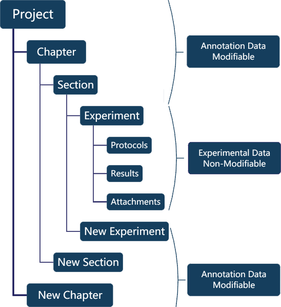

.. _project-management-project-structure:

.. rst-class:: title-center
   
#################################################
笔记本结构
#################################################

在 SimpleELN 中，具有相对明确目标的数据集可以被归类为笔记本，并被指定为一个具有唯一标识符和属性的项目。每个项目包含不可修改的实验数据和可根据需要修改的注释数据，提供了一种结构化的方式来组织实验数据和注释。这不仅有助于研究人员之间的协作与共享，还确保了数据的完整性和可追溯性，并提供了高效的搜索功能。

    
    项目的典型结构
    

.. rst-class:: title-center h2
   
   示例截图

项目可以根据日期、时间、主题或任何有意义的标准进行分类。以下是一些显示典型项目组织模式的截图。

.. grid:: 1 1 2 2

    .. grid-item::

       .. figure:: images/demo-project/structure-by-objective.png
           :align: center
           :class: sd-my-4
           :alt: 项目结构
           
           按目标分组
           
       
    .. grid-item::

       .. figure:: images/demo-project/structure-by-datatime.png
           :align: center
           :class: sd-my-4
           :alt: 项目结构
           
           按日期和时间分组
           
       
    .. grid-item::

       .. figure:: images/demo-project/structure-by-subject.png
           :align: center
           :class: sd-my-4
           :alt: 项目结构
           
           按目标分组
           
       
    .. grid-item::

       .. figure:: images/demo-project/structure-by-datatime-2.png
           :align: center
           :class: sd-my-4
           :alt: 项目结构
           
           按日期和时间分组
           
       